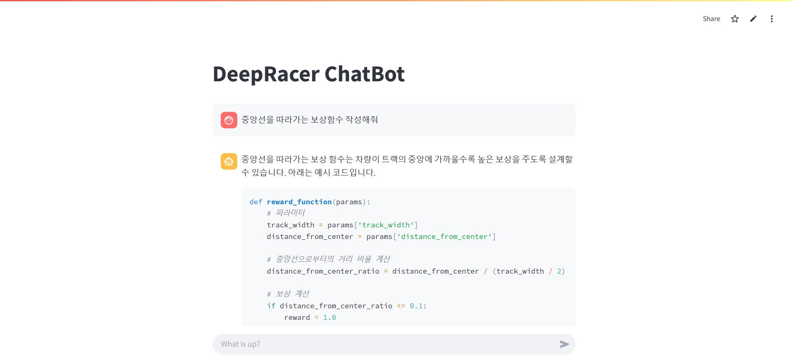

# deepracer-chatbot

본 저장소는 딥레이서의 보상함수를 작성해주는 챗봇 앱입니다.

Streamlit Cloud를 활용하여 보상함수 챗봇 UI를 구성하였습니다.

챗봇을 시작하려면

1. Streamlit Cloud에 가입합니다.

1. Create app 을 실행하고 Secrets에 OpenAI 키를 아래와 같이 설정하고 앱을 실행합니다.
```
OPENAI_API_KEY = "<your-openai-api-key>"
```



